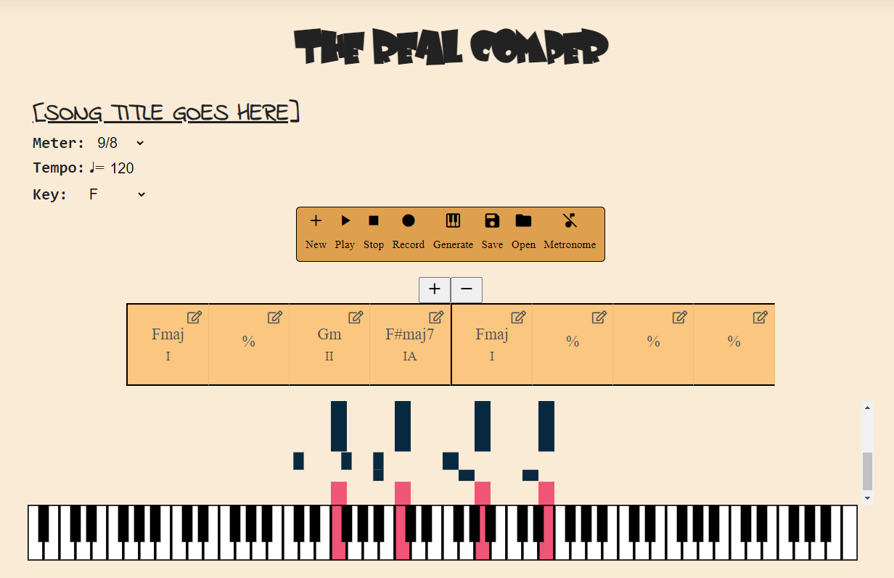
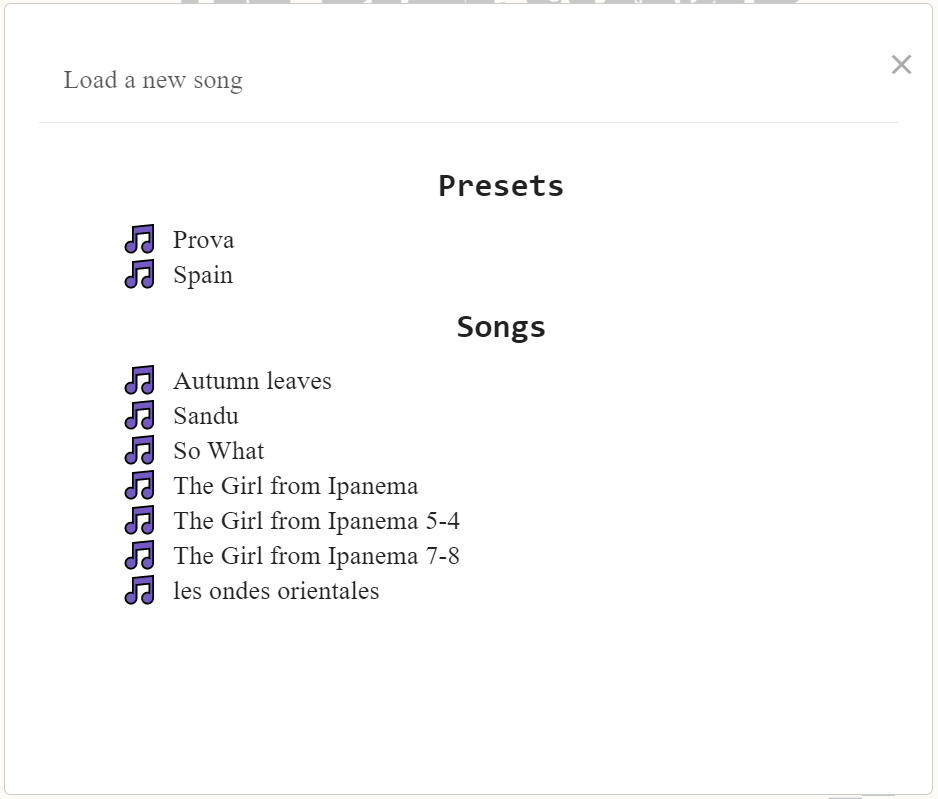
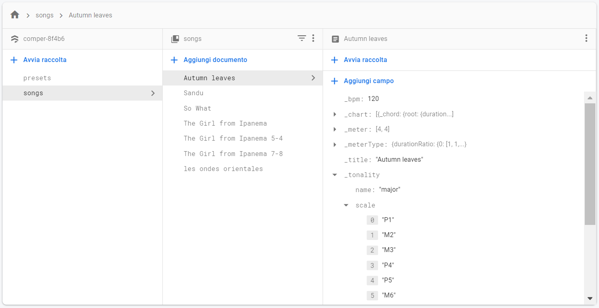

# The Real Comper
## What is the Real Comper?
_The Real Comper_ is a web app which chooses chord voicing solutions for a given a melody and a chord progression. 

## How does it work? 
The app is composed by an editor, in which you can write your own chord progression, and a visualizer in which the final chord progression is retrieved. 
Connect your midi device and start creating!

> Welcome page of the application

## First steps
 
Click **New** and start creating your song. If you want some hints, you can click on **Open** and watch the presets we made for you.
Set the song title and the meter. Every row of meters is a meter group, an experiment of ours in which you can choose a meter and then compare it to very similar ones and test some perceptive capabilities.
Then, set the Tempo and the Tonality of the song. For the moment, you can only choose major scales as tonality.

## Write your progression
After you have set the song parameters, start writing your own progression by clicking on every chord block (which is quarter note long). Add or remove bars by simply clicking + or -. 
The system is capable of understanding a great variety of chords. A full list of the available chords can be found in the file _chordNotation.txt_.
By clicking on every chord block you get the representation of the notes over the piano keyboard.
 

## Recording and generating a voicing progression
Once you are ready, you can enable the metronome and engage the recording. After that, click on **Generate** and **Play** and watch how the initial chords have changed.
The system performs analysis over your melody in order to look for the best voicing progression that can enrich your melody.

You can even **Generate** a voicing progression even if you didn't record a melody.

## Song customization:
On the left side of the page you can change some parameters about the song such as:
- meter: after you set one meter, you can later change between different meter that share the same number of beats per measure but different duration (e.g.: a 4/4 can be changed into 9/8, intended as 2+2+2+3/8)
- tempo (bpm)
- tonality: transpose automatically all the chords

## Save your composition
You can save the song you wrote, and retrive it later! This is powered by [Firebase](https://firebase.google.com/products/firestore)

> firebase databes, organized in two collection, users saved songs are separated from presets

## Files
_The Real Comper_ is composed of:

- **index.html**
- **main.js**
contains the main js file, containing mainly all the React components
- **midiRecorder.js**
- **songModel.js**
contains firebase Configuration, Song class (the main modelof the app), function to save and retrive this model from firebase, and other functions to export some data from the class, to be feed into in the player
- **voicingCreator.js**
implements the algorithm that generat the voicings
- styles.css, chords_css.css, new_song.css
contains the styling of the application

## Dependencies

- [**React**](https://github.com/facebook/react/): structure of the web page and of the View.
- [**Teoria.js**](https://github.com/saebekassebil/teoria): a powerful music library for Javascript, including some very useful classes such as Note, Interval, Chord and Scale.
- [**html-midi-visualizer**](https://github.com/cifkao/html-midi-player): HTML elements powered by [@magenta/music](https://github.com/magenta/magenta-js/tree/master/music/) (Magenta.js)
- [material icons](https://material.io/resources/icons/?icon=fiber_manual_record&style=round)

## Authors
Paolo Sani 
Luca Gobbato 
Andrés González Paul Rivera

[Licensed under the Non-Profit Open Software License version 3.0](https://tldrlegal.com/license/non-profit-open-software-license-3.0-(nposl-3.0))
